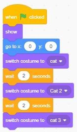
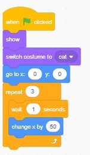
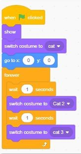
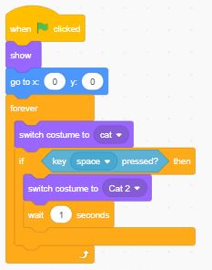
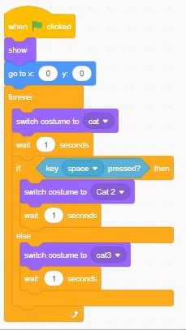
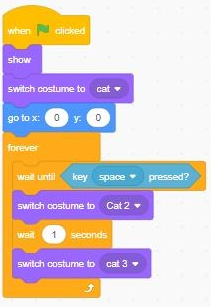

# Control
## wait (tunggu)
#### mengatur waktu untuk menjalankan perintah berikutnya

## repeat
##### mengulang perintah sebanyak (...)

## forever
#### mengulang perintah berterusan kecuali ada batasan

## if (Jika)
#### Menjalankan 1 perintah yang benar sesuai syarat yang di tentukan.

## if-else (Jika-lainnya)
#### Menjalankan 2 perintah yang benar sesuai syarat yang di tentukan.

## wait until
#### menunggu untuk perintah selanjutnya dengan syarat tertentu

