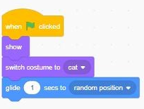
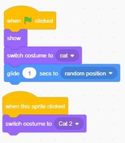
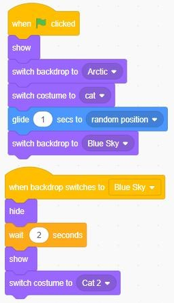
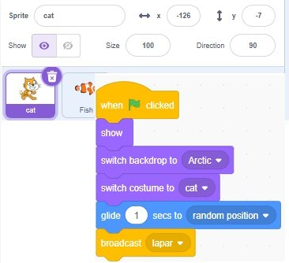
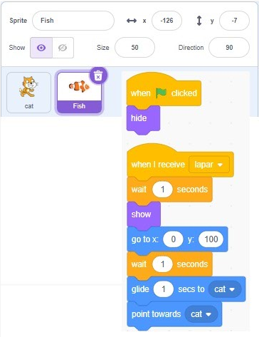

## when green flag klicked
#### perintah di jalankan ketika green flag di klik

## when ... key pressed
#### melakukan perintah ketika ... ditekan

## when this sprite clicked
#### sprite melakukan perintah jika di klik

## when backdrop switches to ...
#### perintah di lakukan ketika ganti backdrop

## broadcast 
#### membuat perintah dengan pesan panggilan

## when i receive
#### perintah  saat menerima pesan panggilan

