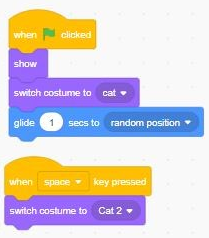

# Event
## when green flag klicked
Perintah di jalankan ketika green flag di klik

## when ... key pressed
Melakukan perintah ketika ... ditekan

## When this sprite clicked
Sprite melakukan perintah jika di klik

## When backdrop switches to ...
Perintah di lakukan ketika ganti backdrop

## Broadcast 
Membuat perintah dengan pesan panggilan

## When i receive
Perintah  saat menerima pesan panggilan

