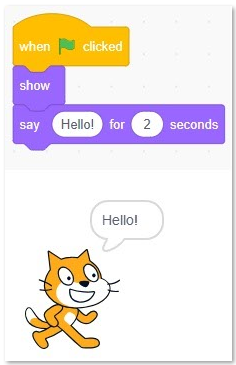
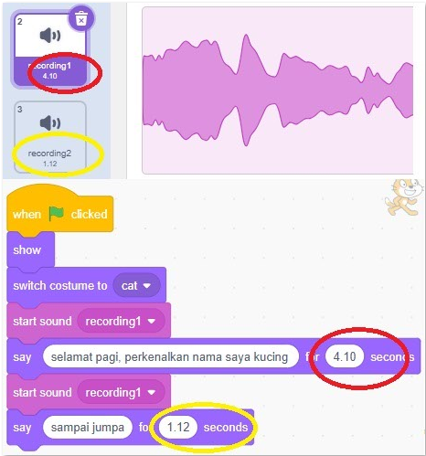
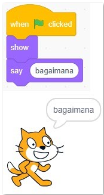
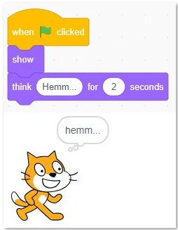
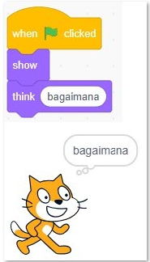
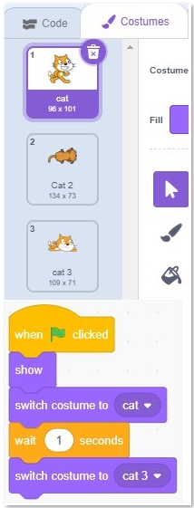
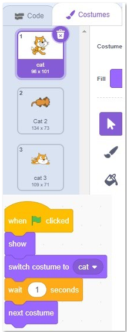

## say ... for ... second
#### perintah menampilkan tulisan dengan batasan waktu lalu tulisan menghilang

#### perintah menampilkan tulisan dengan batasan waktu dan suara

## say ...
#### perintah menampilkan tulisan 

## think ... for ... second
#### perintah menampilkan tulisan (kotak tulisan berfikir) dengan batasan waktu lalu tulisan menghilang

## think ...
#### perintah menampilkan tulisan (kotak tulisan berfikir) 

## switch costum
#### perintah berganti gambar dalam 1 sprite

## next costum
#### perintah berganti gambar secara urut dalam 1 sprite

