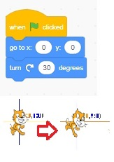
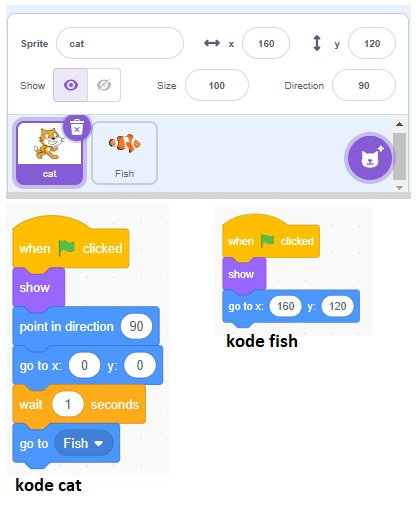

## Move ...
#### gerakan sebanyak ...

## turn ... degrees
#### memutar obyek sebanyak ... derajat

## go to object
#### menggerakkan sprite ke obyek

## go to x= y=
#### meletakkan/menggerakkan obyek pada x,y tertentu

