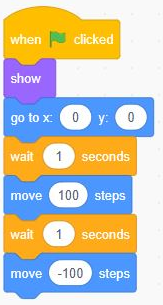
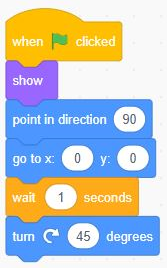
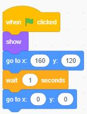
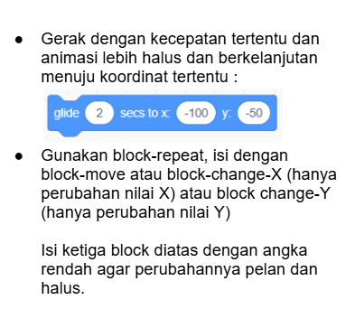

# Motion
block yang digunakan untuk mengontrol pergerakan sprite, seperti memutar, berpindah, dan mengendalikan penempatan sprite. Blok Motion memiliki warna biru muda. 
## Move ...
gerakan sebanyak ...

## turn ... degrees
memutar obyek sebanyak ... derajat

## go to object
menggerakkan sprite ke obyek

## go to x= y=
meletakkan/menggerakkan obyek pada x,y tertentu

## Gerakan menuju arah dan posisi tertentu

## mengatur kecepatan gerak objek

