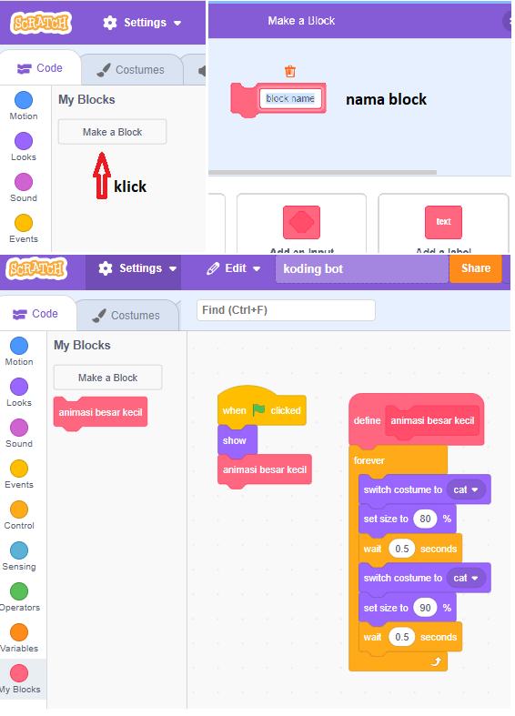

# My block
Block yang bisa di buat sendiri dan berisi beberapa perintah. penggunaannya :
- Beri nama block yang akan dibuat
- Susun block perintah yang akan di isikan dalam my block tersebut.
- Block baru telah siap digunakan.

