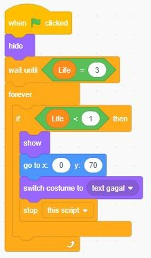

# Operator
Operator adalah blok kode (berwarna hijau) yang berfungsi untuk melakukan perhitungan matematika dan logika

## Operator ... = ... dan ... <... 

## Operator ... and ... (dua syarat yang harus dipenuhi baru perintah dijalankan)
