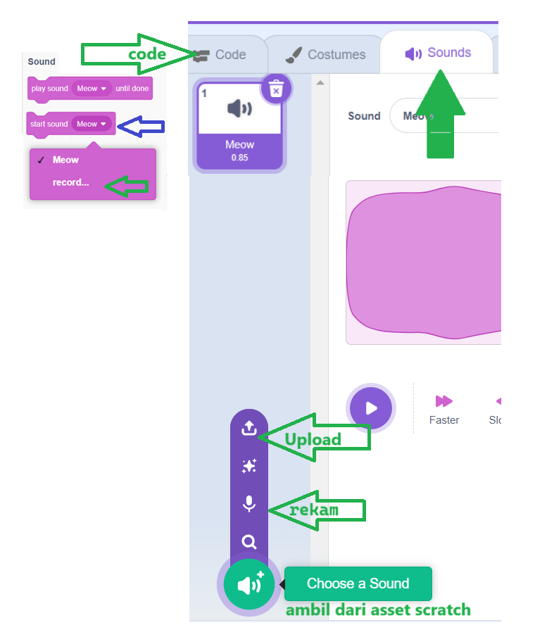
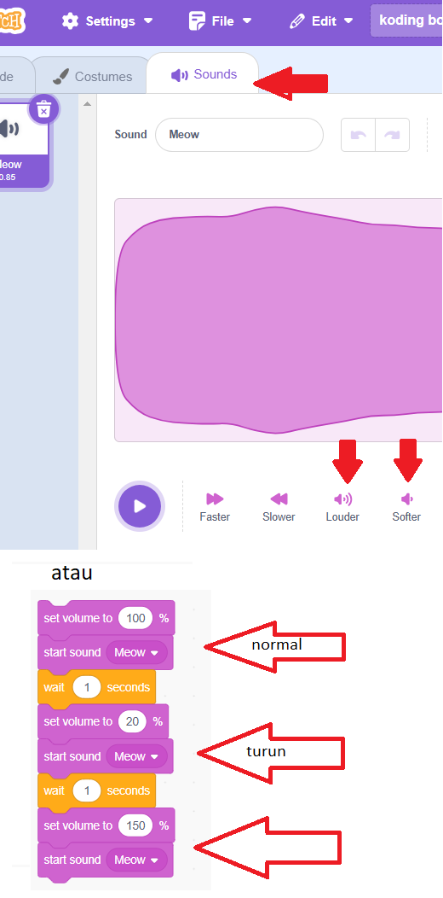

# Sound
## Play sound... until done
perintah memainkan suara sampai selesai, baru selanjutnya melakukan perintah blok dibawahnya.

## Play sound
perintah memainkan suara bersamaan dengan melakukan perintah blok dibawahnya.

## Input sound
memberikan efek suara atau musik pada objek 

## Mengatur volume
menaikkan dan menurunkan volume

