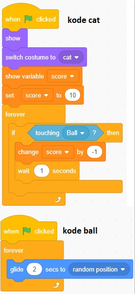

## variable
#### tempat menyimpan nilai yang bisa diakses dan diubah oleh program, contoh dalam game ada variabel score. score bisa diubah (+/-) sesuai syarat dan perintah yang di programkan
#### variabel bertambah

#### variabel berkurang

#### variabel berubah secara berterusan selama program dijalankan

#### variabel-costum
