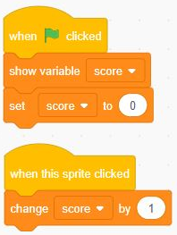
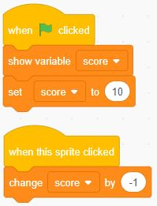
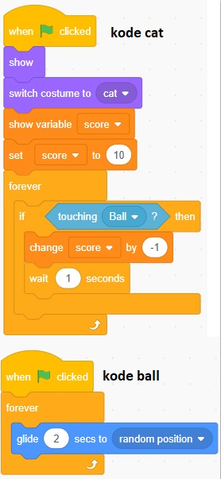

# Variable
Variable adalah tempat menyimpan nilai yang bisa diakses dan diubah oleh program, contoh dalam game ada variabel score. score bisa diubah (+/-) sesuai syarat dan perintah yang di programkan
## Variable bertambah

## Variable berkurang

## Variable berubah secara berterusan selama program dijalankan

## Variable costum
